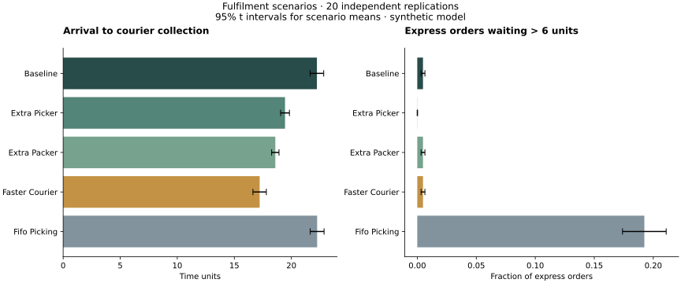

# Fulfilment Simulation

**Which operational change reduces order turnaround most: another picker, another packer, or more frequent courier collection?**

A reproducible SimPy experiment that follows orders through priority picking, FIFO packing, and courier collection. It compares five scenarios with paired random inputs and confidence intervals across independent replications.

[](https://github.com/Suhail15/Fulfilment-Simulation/actions/workflows/checks.yml)



## Measured result

Across 20 replications of the default **synthetic** model, halving the courier interval reduced mean arrival-to-collection time from **22.24 to 17.22 time units**. The paired difference was **−5.02**, with a 95% interval of **[−5.06, −4.98]**. An extra packer reduced it by 3.65 units; an extra picker by 2.80.

These results identify collection frequency as the largest turnaround improvement among the tested scenarios under these assumptions. They do not establish the most cost-effective staffing plan: wages, courier costs, and real operating data are not modelled.

[Full results](results/README.md) · [Every replication](results/replications.csv) · [Configuration and statistical output](results/report.json)

## Run it

Python 3.11:

```bash
python3 -m venv .venv
source .venv/bin/activate
pip install -r requirements.txt
python -m fulfilment.experiment --replications 20 --seed 2025 --output results
python -m unittest discover -s tests -v
```

The experiment writes an SVG chart, a Markdown results table, per-replication CSV, and a JSON report. It uses no external dataset or credentials. To change model parameters programmatically, pass a `Config` to `simulate` or `experiment`:

```python
from fulfilment.model import Config, simulate
result = simulate(Config(pickers=4, packers=2, courier_interval=10), seed=2025)
print(result["metrics"])
```

## Model and experimental design


| Component | Default |
|---|---|
| Arrival process | Exponential interarrival times, rate 0.8 |
| Picking and packing | Exponential service times, means 3 and 2 |
| Express orders | 25%; non-preemptive priority at picking |
| Collection | Fixed interval, unlimited courier capacity |
| Measurement | Arrival cohort from time 1000 to 6000 |
| Scenarios | Baseline, extra picker, extra packer, twice-frequent courier, FIFO picking |
| Replications | 20 seeds, starting at 2025 |

**Randomness is controlled at the order level.** Separate streams generate interarrival times, express status and both service requirements. Service times are sampled on arrival, so changes in staffing or priority do not reassign random draws to different orders. The same seed pairs scenarios; different seeds supply independent replications.

**Uncertainty is measured across replications.** Each scenario reports 95% Student-t intervals for its mean metrics. Scenario differences use paired per-seed differences. These are individual intervals without a multiple-comparison correction; they measure simulation noise, not model validity. The mean of per-run 95th percentiles is reported separately from the mean turnaround time.

**Measurement boundaries are explicit.** Utilisation integrates the portion of each service interval overlapping the fixed observation window. Mean picking queue length uses the same interval-overlap method on waiting times. All accepted orders are drained to courier collection after arrivals close, so slow orders are not silently discarded. Courier operations continue during warm-up; only their measurement begins after warm-up. Empty groups are recorded as missing values, not zero.

## Corrections and extensions

The original simulation measured completion at packing even though collection was another stage. This version includes collection in total time and reports processing and courier waits separately. It also corrects service durations crossing observation boundaries, removes the broken alternative implementation, and replaces one-run batch estimates with independent replications and paired comparisons.

The tests check repeatability, shared random inputs, event ordering, collection timing, utilisation bounds, boundary overlap, missing express groups, overloaded-system draining, and confidence interval calculations.

## Limitations

- This is a finite-window model with a warm-up and final drain, not a certified steady-state estimate. Closing arrivals affects the last orders, especially under overload; drain duration and the number collected after closing are reported.
- Warm-up duration and replication count are explicit choices; no automated convergence or power analysis is claimed.
- Arrivals and service times are independent; travel, breaks, inventory shortages, shift patterns, finite courier capacity and costs are omitted.
- Queue priority is non-preemptive. FIFO can change express waiting times even when overall mean turnaround barely changes.
- The model has not been calibrated against a real warehouse. Results use abstract time units.

Developed from individual university simulation by [Mohammed Suhail Hussain](https://github.com/Suhail15). Uses [SimPy shared resources](https://simpy.readthedocs.io/en/latest/topical_guides/resources.html). No software license has been selected.
